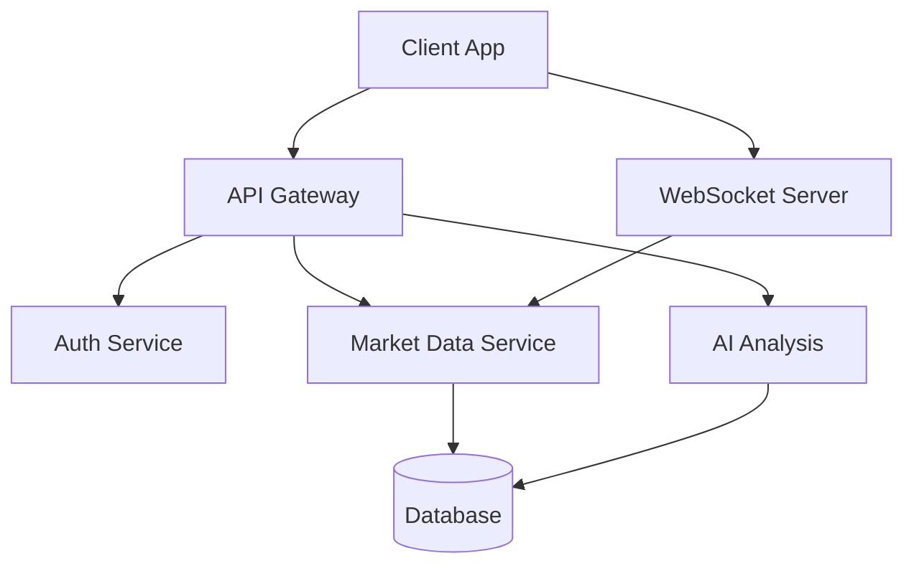
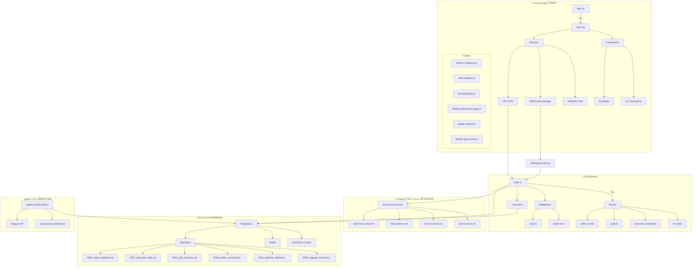
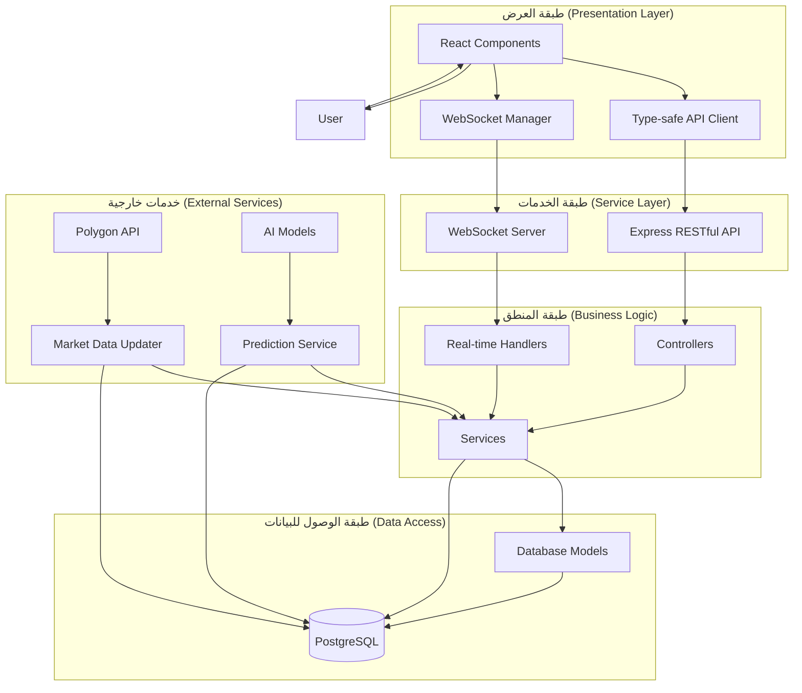
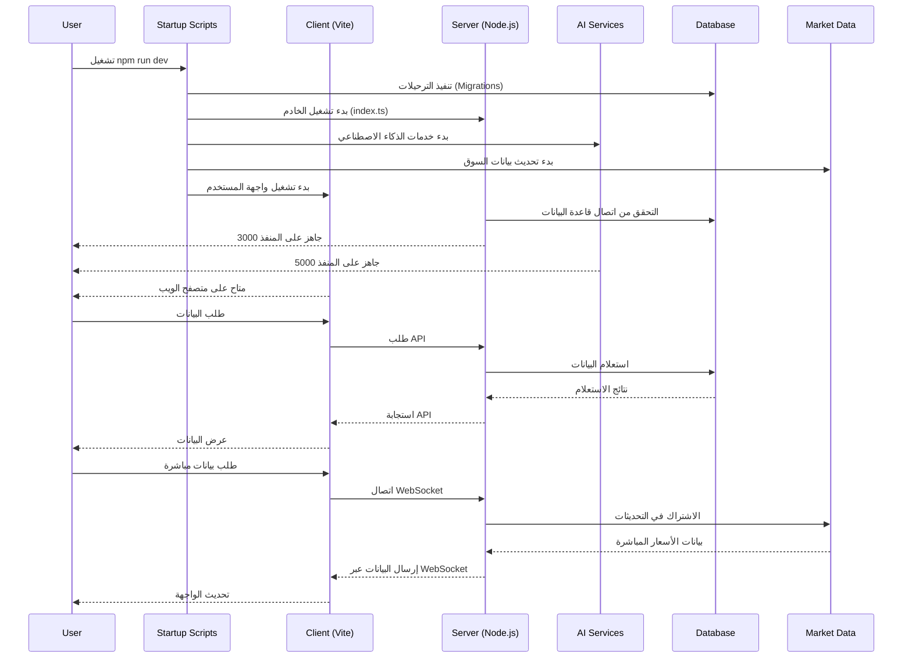
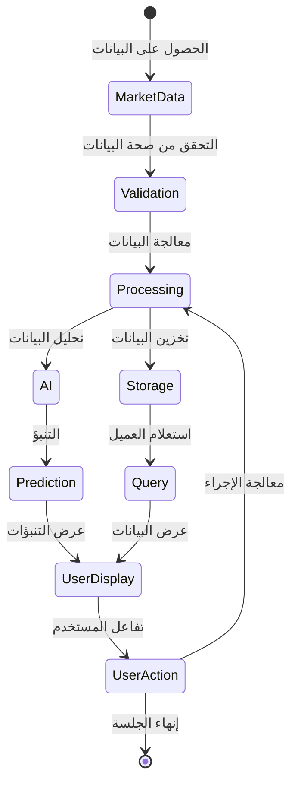

# Application Architecture

## System Overview

The application follows a microservices architecture with the following main components:

### Frontend (Client)

- React-based SPA with TypeScript
- WebSocket integration for real-time updates
- Centralized state management
- Component-based architecture

### Backend Services

- Main API Server (Node.js/Express)
- WebSocket Server for real-time data
- Market Data Service
- AI Analysis Service
- Authentication Service

### Data Storage

- PostgreSQL for persistent data
- Redis for caching
- Real-time market data streams

## Service Communication

## Security Layer

- JWT Authentication
- Role-based access control
- API rate limiting
- Data encryption

## مخطط بنية تطبيق منصة التداول

## المخطط الهيكلي

## مخطط تدفق البيانات

## مخطط تشغيل التطبيق

## مخطط دورة حياة البيانات

## ملاحظات التنفيذ

1. **تشغيل التطبيق**:

   - يستخدم `npm run dev` لتشغيل وضع التطوير
   - يستخدم `npm run start` لوضع الإنتاج مع `NODE_ENV=production`

2. **إدارة الذكاء الاصطناعي**:

   - يتوفر API خاص بنموذج اللغة العربية
   - يمكن إعادة تشغيل خدمات الذكاء الاصطناعي بشكل مستقل

3. **إدارة قاعدة البيانات**:

   - تنفذ الترحيلات تلقائيًا عند بدء التشغيل
   - توجد أدوات للتحقق من أداء قاعدة البيانات

4. **بيانات السوق**:

   - تحديث تلقائي باستخدام وظائف Cron
   - مصدر البيانات هو Polygon API

5. **واجهة المستخدم**:
   - مكتوبة باستخدام React و TypeScript
   - تستخدم مكتبات التحقق من صحة البيانات
   - تدعم WebSocket للبيانات في الوقت الفعلي
