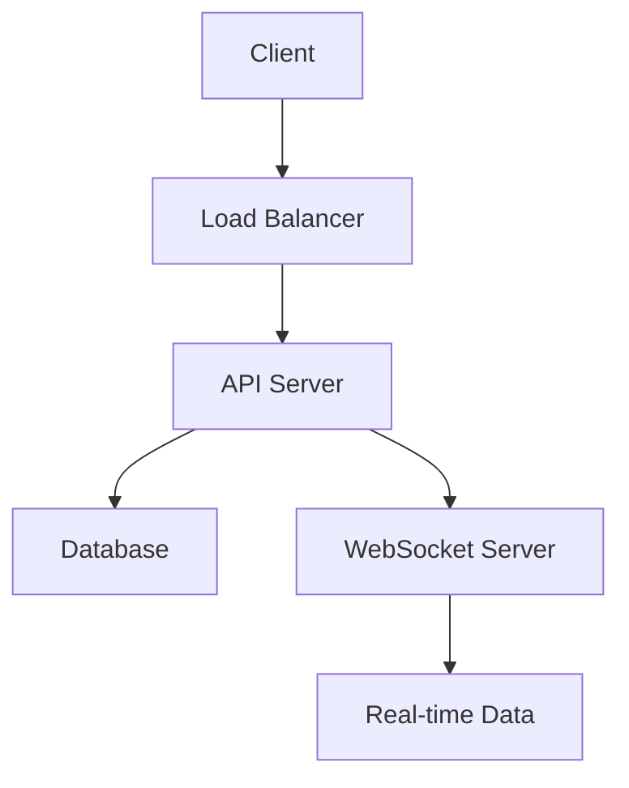

# Technical Documentation

## Database Schema

### User Schema

```sql
CREATE TABLE users (
    id SERIAL PRIMARY KEY,
    username VARCHAR(255) UNIQUE NOT NULL,
    email VARCHAR(255) UNIQUE NOT NULL,
    password_hash VARCHAR(255) NOT NULL,
    created_at TIMESTAMP DEFAULT CURRENT_TIMESTAMP
);
```

### Trading Data Schema

```sql
CREATE TABLE trading_data (
    id SERIAL PRIMARY KEY,
    symbol VARCHAR(20) NOT NULL,
    price DECIMAL(10,2) NOT NULL,
    volume INTEGER NOT NULL,
    timestamp TIMESTAMP NOT NULL
);
```

### Indexes and Optimizations

```sql
CREATE INDEX idx_trading_data_symbol ON trading_data(symbol);
CREATE INDEX idx_trading_data_timestamp ON trading_data(timestamp);
```

## Real-Time Data Handling

### WebSocket Implementation

```javascript
class WebSocketHandler {
  constructor(port) {
    this.server = new WebSocket.Server({ port });
    this.clients = new Set();
  }

  broadcast(data) {
    this.clients.forEach((client) => {
      if (client.readyState === WebSocket.OPEN) {
        client.send(JSON.stringify(data));
      }
    });
  }
}
```

### Data Flow

1. Data reception from external sources
2. Processing and validation
3. Storage in database
4. Broadcasting to connected clients

### Performance Optimizations

- Connection pooling
- Message batching
- Rate limiting
- Load balancing

## Testing Structure

### Unit Tests

```javascript
describe("Trading Service", () => {
  it("should calculate correct profit/loss", () => {
    const service = new TradingService();
    expect(service.calculatePL(100, 120, 10)).to.equal(200);
  });
});
```

### Integration Tests

```javascript
describe("Database Integration", () => {
  before(async () => {
    await db.connect();
  });

  it("should store trading data", async () => {
    const result = await db.storeTradingData({
      symbol: "AAPL",
      price: 150.5,
    });
    expect(result).to.be.ok;
  });
});
```

### Performance Tests

- Load testing configuration
- Stress test scenarios
- Benchmark results

## File Organization

### Project Structure

```
project/
├── src/
│   ├── api/
│   ├── services/
│   ├── models/
│   └── utils/
├── tests/
│   ├── unit/
│   ├── integration/
│   └── performance/
└── docs/
```

### Code Organization Guidelines

1. Feature-based organization
2. Clear separation of concerns
3. Consistent naming conventions
4. Documentation requirements

## Database Optimization Summary

### Query Optimization

```sql
-- Optimized query example
SELECT
    t.symbol,
    t.price,
    t.volume
FROM trading_data t
WHERE t.timestamp >= NOW() - INTERVAL '1 day'
AND t.symbol = 'AAPL'
ORDER BY t.timestamp DESC
LIMIT 100;
```

### Index Strategy

1. Primary key optimization
2. Foreign key indexing
3. Composite indexes for common queries
4. Index maintenance procedures

### Performance Monitoring

- Query execution plans
- Index usage statistics
- Cache hit ratios
- Connection pool metrics

### Backup and Recovery

1. Backup schedule
2. Recovery procedures
3. Point-in-time recovery
4. Disaster recovery plan

## System Architecture

### Components



### Security Measures

1. Authentication
2. Authorization
3. Rate limiting
4. Data encryption

### Monitoring

- System metrics
- Application logs
- Error tracking
- Performance monitoring

### Deployment

1. CI/CD pipeline
2. Environment configuration
3. Release procedures
4. Rollback strategy

# Technical Documentation

## System Architecture

### Core Components

- Full-stack TypeScript/Node.js with React frontend
- PostgreSQL database with Drizzle ORM
- WebSocket server for real-time market data
- AI-powered customer support system

### Real-Time Features

- WebSocket Manager with automatic reconnection
- Message queuing system
- Circuit breaker pattern implementation
- Connection pooling optimization

### Database Implementation

- Comprehensive schema with related tables
- Optimized query patterns
- Connection pooling
- Cache layer implementation

### Market Data Integration

- Polygon.io API integration
- Real-time data streaming
- Smart caching system
- Rate limiting and error handling

### Security

- Crypto scrypt authentication
- Token-based session management
- Role-based access control
- Environment variable-based secrets

### UI Components

- Responsive design
- Localization framework
- Light/Dark theme support
- Real-time market updates

## Performance Optimizations

1. WebSocket connection pooling
2. Database query optimization
3. Selective updates based on price thresholds
4. In-memory cache system
5. Message queuing for high volume

## Error Handling

- Circuit breaker for API calls
- Exponential backoff for reconnections
- Comprehensive error logging
- Fallback mechanisms

## Monitoring

- Real-time system health checks
- WebSocket metrics tracking
- Cache performance monitoring
- Market data update tracking

## Development Guidelines

1. Use TypeScript for type safety
2. Follow component-based architecture
3. Implement comprehensive error handling
4. Maintain proper documentation
5. Write unit tests for critical components
